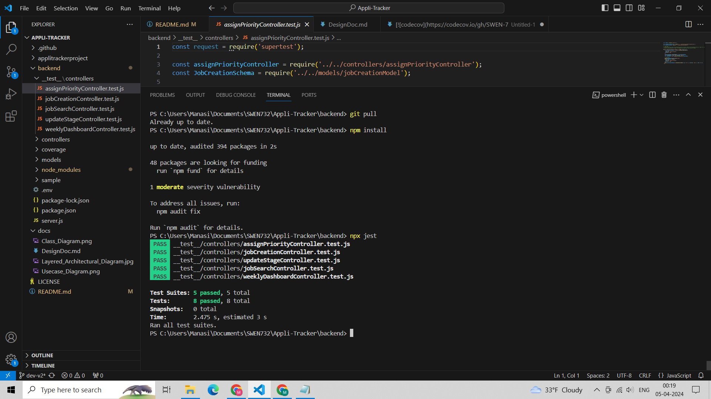

# Appli-Tracker Web Application

Our project Titled 'Appli Tracker' is an web based software which helps in creating a Job and tracking the application based on the status. It also allows User to create a Remainder's for upcoming tests or Interview so that it will be easy to track and complete the tasks before the deadlines. Based on number of application user can export the weekly and montly data.

## Team Information
* Team name: Group5
* Team members
  * Gadadare, Shardul, scg6975
  * Londhe, Soudagar, srl1622
  * Patil, Manasi, mp9259
  * Jadhav, Sakshi, sj9017
  * Shah, Parva, ps7384

## Documentation

This design document encompasses comprehensive details regarding the 'Appli Tracker' project developed by Team Group5. It begins with team information, listing members contributing to the project. The executive summary succinctly outlines the project's objectives, emphasizing its web-based nature for job creation, tracking, and scheduling. Requirements are meticulously defined, with a focus on the Minimum Viable Product (MVP) features ranging from user authentication to data export capabilities. Architecture and Design sections delve into the system's layered architecture, illustrated through diagrams depicting software architecture, use cases, and class structures. Each aspect is meticulously explained, from user management to notification systems, ensuring a clear understanding of the system's functionality and design principles.

[DesignDoc.md](https://github.com/SWEN-732-Team-5/Appli-Tracker/blob/dev-v2/docs/DesignDoc.md)

## Minimum Requirements

[NPM Version: 10.5.0]

[Node v21.7.1]

## How to run it

* Clone the git repository `https://github.com/SWEN-732-Team-5/Appli-Tracker.git`
* Type `cd backend`
* Run `npm install` to install dependencies
* Run `npx jest` to run all the Unit Test Cases

## Testing

## MVPs covered for Unit Test:

1. File attachments : Users can attach Resumes, CVs or any documents related to each job entry which they submitted for that particular job. [Link](https://github.com/SWEN-732-Team-5/Appli-Tracker/blob/dev-v2/backend/__test__/controllers/addAttachmentsController.test.js)

* TEST CASE - 1
Test case for attachement files or images to a particular Job. We are mocking addAttachmentsController by passing jobId '123' and document 'additional_document.pdf' attach so that it will return the json of updated Job and we are verifying it using Assertions. 

* TEST CASE - 2
Test case for attachement files or images to a particular Job. We are mocking addAttachmentsController by passing jobId '567' and document 'degree_certificate.pdf' attach so that it will return the json of updated Job and we are verifying it using Assertions

2. Creating schedules : Users can add To-dos for online assessment, Interview rounds or any other rounds. [Link](https://github.com/SWEN-732-Team-5/Appli-Tracker/blob/dev-v2/backend/__test__/controllers/addTodoController.test.js)

* TEST CASE - 3
Test case for creating a Todo for already applied Jobs so that user could receive alerts accordingly. We passed 'title', 'deadline' to complete todo and 'description' for OA Round 1 for Paychex company. Controller returns updated json and we are verifying it using assertions.

* TEST CASE - 4
Test case tests for creating a Todo for already applied Jobs so that user could receive alerts accordingly. We passed 'title', 'deadline' to complete todo and 'description' for Apptitute Round 1 for Apple company. Controller returns updated json and we are verifying it using assertions

3. Priority levels : Users can assign priority levels (e.g., high, medium, low) to the Job. Test case tests for assigning priority to the job. Here we are assigning priority as 'High' for a particular Job which is distinguished by 'JobID', the updated Job should also have priority as High. [Link](https://github.com/SWEN-732-Team-5/Appli-Tracker/blob/dev-v2/backend/__test__/controllers/assignPriorityController.test.js)

* TEST CASE - 5
Test case for assigning priority to the job. Here we are assigning priority as 'High' for a particular Job which is distinguished by 'JobID', the updated Job should also have priority as High.

4. Data export : Users can export job data to csv or Excel format for further analysis for all jobs he/she applied. [Link](https://github.com/SWEN-732-Team-5/Appli-Tracker/blob/dev-v2/backend/__test__/controllers/extractAllJobsController.test.js)

* TEST CASE - 6
Test case for extracting all jobs applied by particular user, so that in frontend side we can export in excel or csv files. Here we have passed 'username' and 'email' of the user so that all jobs applied by that particular user is extracted

5. Job creation : Users can create new job entries based on Co-ops or Full Time with a title, description and pay. When API endpoint ‘/createjob’ is called, job details are passed in the request body which comprises 'job_title','description', 'type' and 'payment'. This data is saved in the Mongodb database. If successfully saved it returns status code as 200 and also returns the json of recently created Job. Here, we are testing whether response status, job_title, description, type and payment matches with a recently created job. [Link](https://github.com/SWEN-732-Team-5/Appli-Tracker/blob/dev-v2/backend/__test__/controllers/jobCreationController.test.js)

* TEST CASE - 7
Unit test case if new Job is created successfully, Here we have mocked jobCreationController and jobCreationController() is called and job details are passed in request body which comprises of 'job_title','description', 'type' and 'payment' and in response the controller returns the json of recently created Job. Here, we are testing whether job_title, description, type and payment matches with the created job

* TEST CASE - 8
Test case defines about creation of new Co-op position for a 'Apple' company once it is created successfully it checks whether the description, Job type 'Co-op' and 'Pay' matches with the actual create Co-op Job.

6. Search functionality : Users can search a job by company name, applied date, or category. Test case tests for searching a Job w.r.t location, if a user wants to search all the jobs he/she applied based on ‘Rochester’ location, here we are testing whether jobs returned by API is ‘Rochester’ based only. Test case also tests for searching a Job w.r.t date, if the user wants the Job data based on the date which he/she has applied. Here we are testing whether all jobs searched w.r.t 02/12/2024 date matches or not. [Link](https://github.com/SWEN-732-Team-5/Appli-Tracker/blob/dev-v2/backend/__test__/controllers/jobSearchController.test.js)

* TEST CASE - 9
Test case tests for searching a Job w.r.t location, if user wants to search all the jobs he/she applied based on Rochester location, here we are testing whether jobs returned by jobSearchController is Rochester based only.

* TEST CASE - 10
Test case tests for searching a Job w.r.t date, if user wants the Job data based on date which he/she has applied. Here we are testing whether all jobs searched w.r.t 02/12/2024 date matches or not.

7. Calendar view : Users can view jobs on a calendar to visualize deadlines and workload montly. [Link](https://github.com/SWEN-732-Team-5/Appli-Tracker/blob/dev-v2/backend/__test__/controllers/monthlyCalendarController.test.js)

* TEST CASE - 11
Test case for extracting all Todo created by user w.r.t to month and year so that displaying in the calendar view would be easy to navigate through the deadline for the user. We have passed 'username', 'email' and monthyear passed in format MM/YYYY as March 2024, it will return all Todos for March 2024.

* TEST CASE - 12
Test case tests for extracting all Todo created by user w.r.t to month and year so that displaying in the calendar view would be easy to navigate through the deadline for the user. Here we have passed 'username', 'email' and monthyear passed in format MM/YYYY as April 2024, it will return all Todos for April 2024.

8. Tracking : Based on Recruitments reply users can edit and view the application status which makes it easier for tracking. Test case tests for updating a status or stage of a Job as a 'Interview'. Based on the recruiters response, if a user wants to update the status of a particular Job, he/she can update the stage. Here we are testing whether the updated stage is an Interview. [Link](https://github.com/SWEN-732-Team-5/Appli-Tracker/blob/dev-v2/backend/__test__/controllers/updateStageController.test.js)

* TEST CASE - 13
Test case tests for updating a status or stage of a Job as a 'Interview'. Based on recruiters response if user wants to update status of a particular Job, he/she can update the stage. Here we are testing whether the updated stage is set to Interview.

* TEST CASE - 14
Test case tests for updating a status or stage of a Job as a 'HR Round'. Based on recruiters response if user wants to update status of a particular Job, he/she can update the stage. Here we are testing whether the updated stage is set to HR Round.

9. Dashboard : The dashboard test case for job applications focuses on assessing jobs applied for within a specified week. By providing start_date and end_date parameters, this test identifies and returns a concise list of jobs applied to during the designated time frame. Ensuring accuracy and efficiency, this test aids in validating the functionality of the dashboard's job application feature, offering valuable insights into user activity and system performance. [Link](https://github.com/SWEN-732-Team-5/Appli-Tracker/blob/dev-v2/backend/__test__/controllers/weeklyDashboardController.test.js)

* TEST CASE - 15
Test case tests for Jobs that are applied during that particular week. It takes start_date and end_date and returns list of jobs applied within that specific period.

# Steps

* Clone the git repository `https://github.com/SWEN-732-Team-5/Appli-Tracker.git`
* Type `cd backend`
* Run `npm install` to install dependencies
* Run `npx jest` to run all the Unit Test Cases

